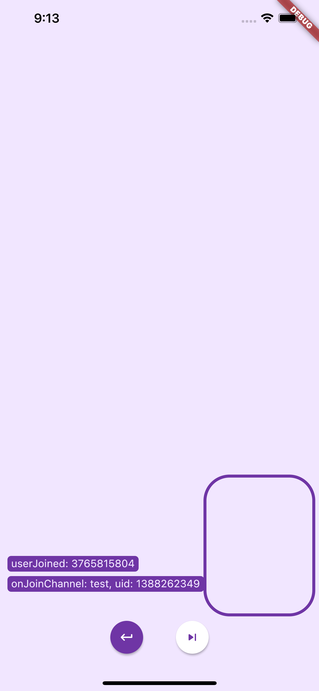
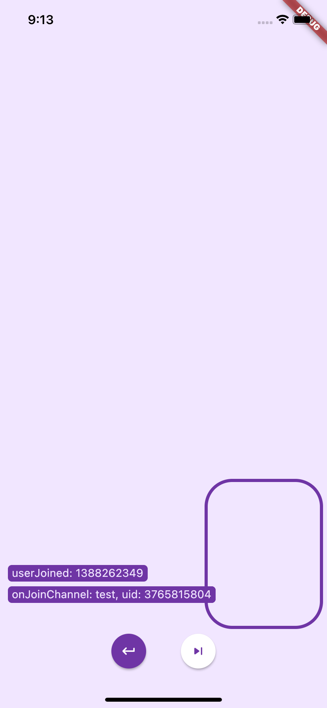
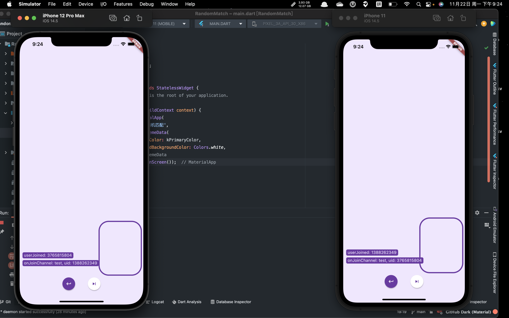

# Random Match

一个基于 Flutter 和 Agora SDK 开发的 demo，支持安卓与IOS，可以让用户进入房间匹配进行视频聊天。

## 使用说明

1. 克隆该项目
2. 替换 `constants.dart` 中的 `APP_ID` 和 `Token` 为你自己在声网申请的
3. 直接运行 `main.dart`

## 使用截图

由于我的模拟器有点问题打不开摄像头，暂时用这个截图凑合着。